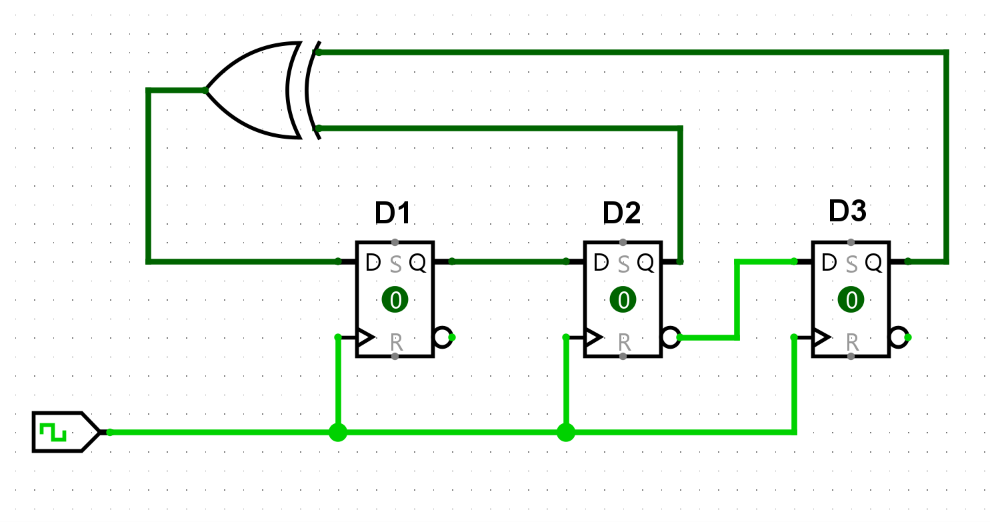
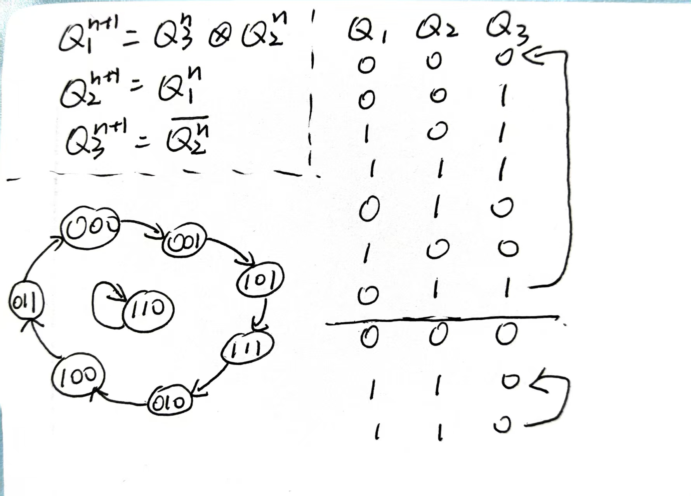
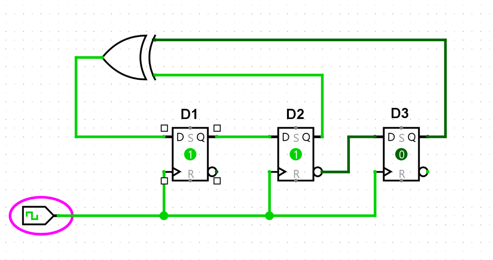

\# 借助 Logisim 复习数电：用 D 触发器搭建反馈移位寄存器

\## 一、实验背景

组合逻辑电路的特点是：输出只和当前输入有关，不保存过去的状态。

时序逻辑电路不仅和当前输入有关，还和电路之前保存的状态有关。触发器就是构成时序逻辑电路的重要基本单元。

\## 二、实验电路

这次我在 Logisim 中搭建了一个由三个 D 触发器和一个异或门组成的反馈移位电路。

实验截图如下：

从图中可以看到，电路主要包含以下部分：

\- 三个 D 触发器，用来保存电路状态；

\- 一个时钟输入，用来控制触发器什么时候更新状态；

\- 一个异或门，用来把部分触发器的输出组合成新的反馈输入；

\- 若干反馈连线，把后级触发器的输出重新送回前级输入。

\## 三、电路结构分析

分析如下。

可以看出来，电路并不可以自启动，会在D1D2D3 = 110 状态循环。

设置初状态 110 ，使用 Logsim 的 poke 仿真，切换时钟高低电平，电路始终维持 110 ，无法进入循环状态。

